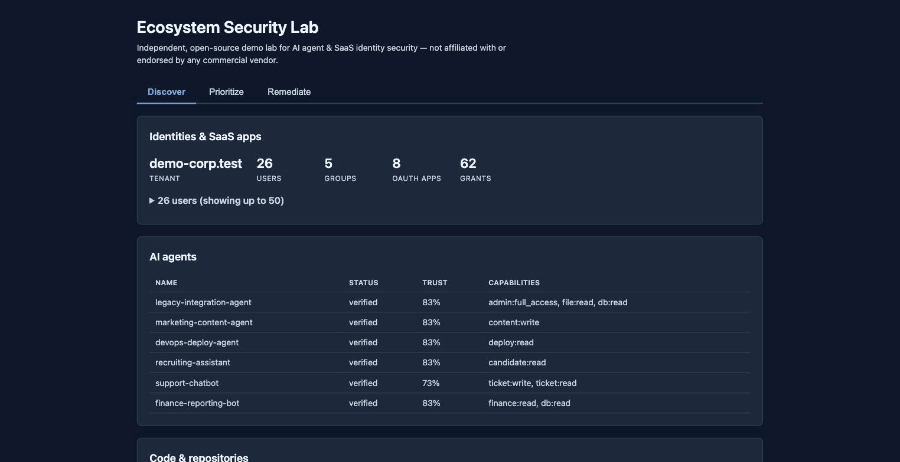

# Ecosystem Security Lab

A working, open-source analog of the AI-agent-and-SaaS-identity-security problem space — built to develop real, hands-on fluency in that category, not to clone or reproduce any commercial product.



Two real, independently-maintained open-source projects, wired together with a synthetic-data layer and a small dashboard:

- **[Cartography](https://github.com/cartography-cncf/cartography)** (CNCF) — builds an identity/permission graph in Neo4j. Validated in this repo against a real public GitHub org, not just synthetic data.
- **[AIM — Agent Identity Management](https://github.com/opena2a-org/agent-identity-management)** — cryptographic AI agent identity, capability-based authorization, and an audit trail. An agent can only do what it's explicitly been granted; anything else is denied and logged, before it executes.
- A synthetic-data generator seeds a fake company (`demo-corp.test`) with users, groups, OAuth-scoped apps, and a fleet of AI agents — including one deliberately over-permissioned grant and one deliberately over-permissioned agent, planted on purpose.
- A dashboard reads both systems live and presents them the way this category of product typically organizes itself: **Discover → Prioritize → Remediate**.

## What's real vs. synthetic

Real: the graph-database software, the agent-identity software, one GitHub org synced live via API, every bug documented in the phase notes below. Synthetic: the company, its users, its AI agents, and the "Revoke" button in the UI (it logs locally, it doesn't call anything).

## See it working

- **[Full build tutorial + platform comparison](https://claude.ai/code/artifact/f52828f9-6e3f-4c1a-aa9e-580499360a80)** — phase-by-phase, including every real bug hit and fixed.
- **[Interactive dashboard replica](https://claude.ai/code/artifact/be31ae44-e6b2-4dc2-8c25-03230056935c)** — real captured data, click-through, no infrastructure required.
- `docs/demo-script.md` — the plain-English talk track, written for a live walkthrough.

## Status

All build phases complete (0 through 7): scaffolding, Cartography validated against live data, AIM validated with a proven deny scenario, synthetic identity + agent data, the unified UI, a guardrails pass, and full-stack validation with a demo script.

## Quickstart

```bash
cp .env.example .env      # fill in real values, .env itself is gitignored
./scripts/demo.sh          # reset, reseed, resync GitHub, verify readiness — the real "get me demo-ready" command
```

Or for iterative work: `docker compose up -d` then `./scripts/reset.sh`. See `scripts/sync-github.sh` if the GitHub panel is ever empty after a reset (expected — it's a separate step to avoid an API call on every teardown).

Binds to `localhost` only by default; see `CLAUDE.md` for the full deployment and security guardrails this project holds itself to.

## Repository structure

```
aim/               AIM's compose file, capability policy notes
cartography/        which modules are enabled and why
synthetic-data/     identity + agent generators, scenario scripts
ui/                 the dashboard
scripts/            reset.sh, sync-github.sh, demo.sh
docs/               demo-script.md and this README's screenshot
CLAUDE.md           full scope, guardrails, and the phased build plan this was built against
```
